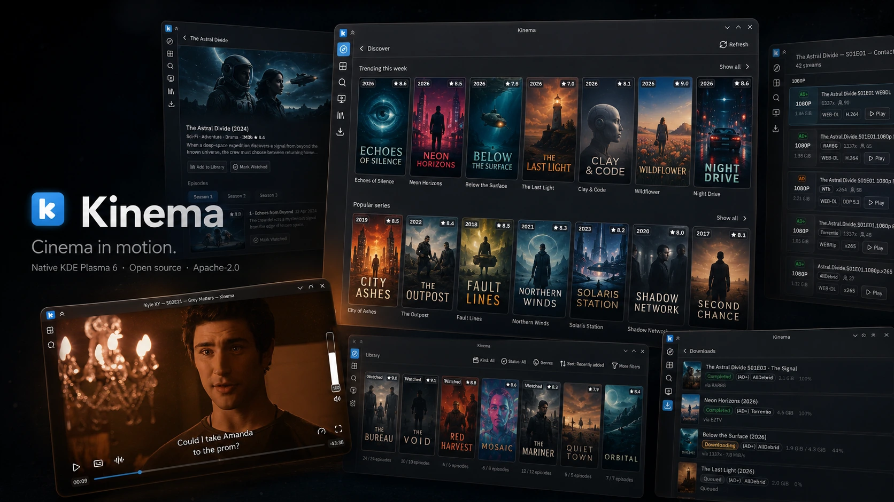
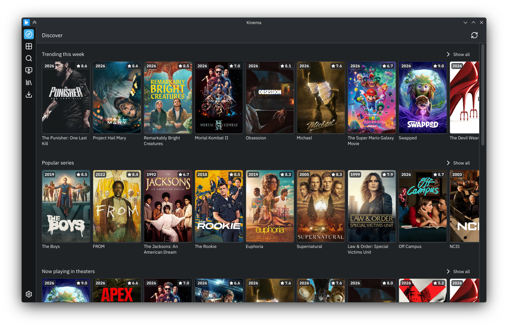
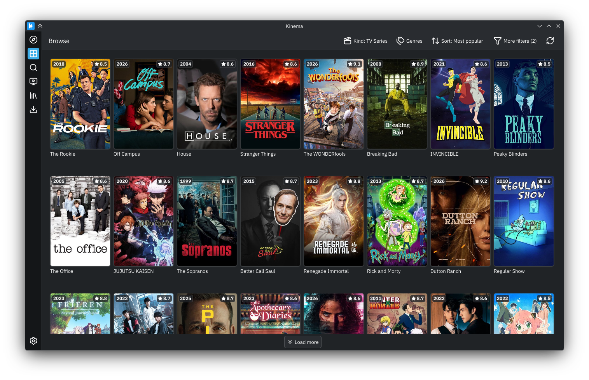
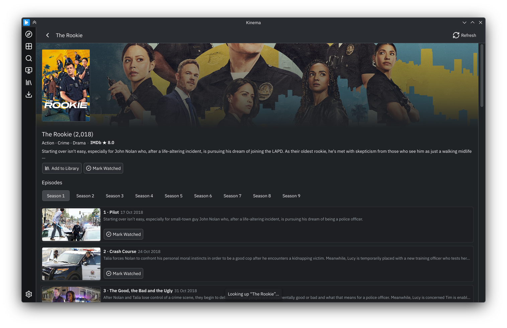
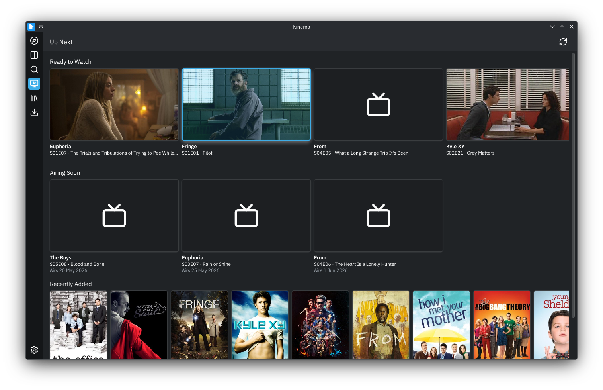
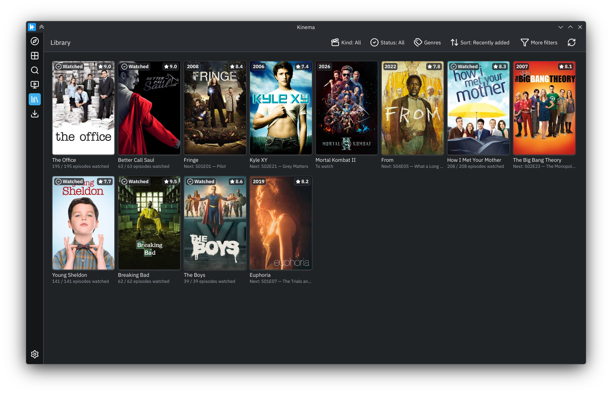
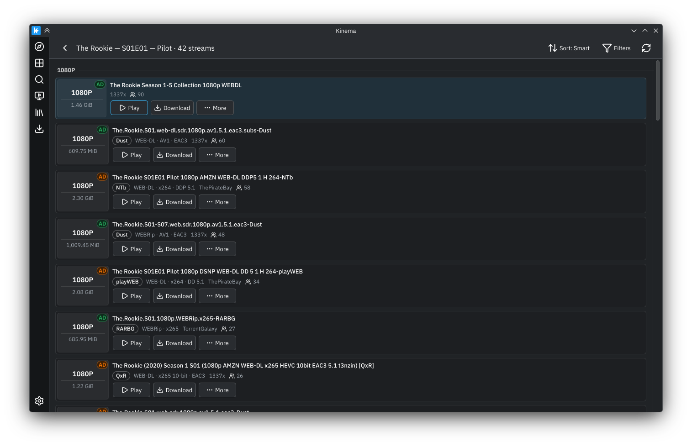
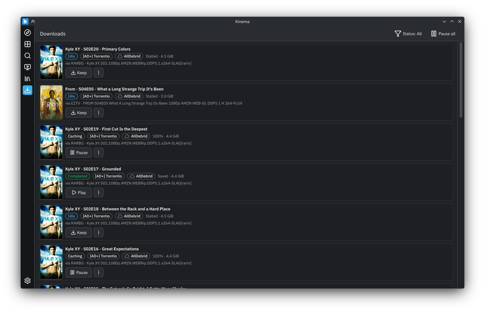
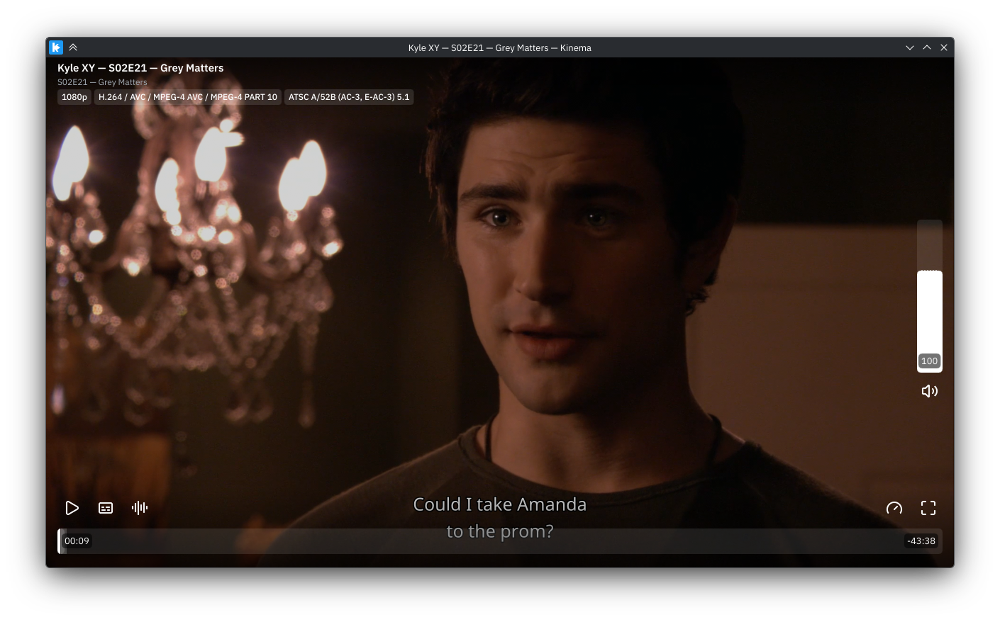

# Kinema

[](https://github.com/ThilinaTLM/kinema/releases/latest)
[](LICENSE)
[](https://kde.org/plasma-desktop/)

**Cinema in motion.** A native KDE Plasma 6 desktop app for discovering
movies and TV series, finding stream sources through public
Stremio-compatible indexers ([Torrentio](https://torrentio.strem.fun/),
[Peerflix](https://github.com/mafintosh/peerflix-server)), and — with a
[Real-Debrid](https://real-debrid.com/) or
[AllDebrid](https://alldebrid.com/) subscription — streaming the result
straight into the built-in **mpv** player or handing it off to external
**mpv** / **VLC**.

## Screenshots



| | |
|:---:|:---:|
|  |  |
| **Browse** — filter by kind, genre, and sort order | **Series detail** — backdrop, metadata, per-season episode list |
|  |  |
| **Up Next** — ready to watch, airing soon, recently added | **Library** — watched-state and next-episode tracking |
|  |  |
| **Streams** — sorted by quality with source / codec / seeder chips | **Downloads** — debrid-backed transfers with per-row status |



*Embedded **mpv** player — episode-aware chrome, live OpenSubtitles overlay, transport / speed / fullscreen controls.*

## Features

- **Discover** powered by TMDB, with a Trending / Popular / Top-rated
  home and a "More like this" rail on every detail page
- **Continue Watching** — resume movies and episodes at the exact
  timestamp, even across different releases of the same title
- **Library** for movies and series, with per-episode watched-state
  tracking
- Search by title or IMDB id; series view with seasons, episodes, and
  per-episode sources
- Stream discovery via **Torrentio** or **Peerflix** (switchable in
  Settings → Indexers), with a universal client-side blocklist for
  resolutions / variants / keywords
- **Real-Debrid** and **AllDebrid** integration with cached-only
  filtering, direct stream URLs, and download manager
- **OpenSubtitles** integration for subtitle search and selection
- Built-in **mpv** player (Qt Quick chrome on top of `mpvqt`) plus a
  one-click hand-off to external mpv / VLC / a custom command
- **MPRIS** support (media keys + desktop control) and a system tray
  with close-to-tray
- First-class **Plasma 6** theming with Kirigami, full keyboard
  navigation

## Install

Official builds are published on the
[Releases page](https://github.com/ThilinaTLM/kinema/releases). Six
artifacts ship per release: two `.deb`s, two `.rpm`s, an `.AppImage`,
and a portable `.tar.gz` (plus the source tarball and a `SHA256SUMS`
manifest).

### System requirements

- 64-bit Linux, glibc ≥ 2.41 (Debian 13 / Ubuntu 25.04 / Fedora 41 /
  Arch 2025 or newer). Older glibc → use a newer host, build from
  source, or extract the AppImage on a newer machine.
- Wayland or X11 session. KDE Plasma 6 is the primary target; other
  Qt 6 desktops work but get less testing.
- ~150 MB free disk for the AppImage / portable tarball; native
  packages are smaller because they reuse system Qt 6 / KF 6 / libmpv.

### Pick a package

| You are on…                                 | Use                                                                                    |
| ------------------------------------------- | -------------------------------------------------------------------------------------- |
| Ubuntu 25.04 (plucky)                       | `.deb` (`ubuntu25.04`)                                                                 |
| Debian 13 (trixie) or newer                 | `.deb` (`debian13`)                                                                    |
| Fedora 41 / 42                              | matching `.rpm`                                                                        |
| Ubuntu 24.04 LTS                            | **AppImage** (system Qt/KF too old — see [`packaging/README.md`](packaging/README.md)) |
| Arch / openSUSE / NixOS / immutable distros | AppImage or portable tarball                                                           |
| Don't want to install anything              | Portable tarball                                                                       |

Each command block below resolves the **latest** release from the
GitHub API. To install a specific version instead, set `VERSION=x.y.z`
before running the rest of the block.

### .deb (Ubuntu 25.04, Debian 13)

```bash
VERSION=${VERSION:-$(curl -fsSL https://api.github.com/repos/ThilinaTLM/kinema/releases/latest \
                       | sed -n 's/.*"tag_name": *"v\([^"]*\)".*/\1/p')}
URL="https://github.com/ThilinaTLM/kinema/releases/download/v${VERSION}"

# Ubuntu 25.04
wget "${URL}/kinema_${VERSION}_amd64-ubuntu25.04.deb"
sudo apt install "./kinema_${VERSION}_amd64-ubuntu25.04.deb"

# Debian 13 (trixie)
wget "${URL}/kinema_${VERSION}_amd64-debian13.deb"
sudo apt install "./kinema_${VERSION}_amd64-debian13.deb"
```

`apt install ./...deb` (not `dpkg -i`) so apt resolves the dependency
chain. mpv and VLC are listed as `Recommends` — install whichever
external player you want, or neither if the built-in mpv is enough.

### .rpm (Fedora 41 / 42)

```bash
VERSION=${VERSION:-$(curl -fsSL https://api.github.com/repos/ThilinaTLM/kinema/releases/latest \
                       | sed -n 's/.*"tag_name": *"v\([^"]*\)".*/\1/p')}
URL="https://github.com/ThilinaTLM/kinema/releases/download/v${VERSION}"

# Fedora 41
wget "${URL}/kinema-${VERSION}-1.fc41.x86_64.rpm"
sudo dnf install "./kinema-${VERSION}-1.fc41.x86_64.rpm"

# Fedora 42
wget "${URL}/kinema-${VERSION}-1.fc42.x86_64.rpm"
sudo dnf install "./kinema-${VERSION}-1.fc42.x86_64.rpm"
```

### AppImage (anything else, including Ubuntu 24.04 LTS)

```bash
VERSION=${VERSION:-$(curl -fsSL https://api.github.com/repos/ThilinaTLM/kinema/releases/latest \
                       | sed -n 's/.*"tag_name": *"v\([^"]*\)".*/\1/p')}
URL="https://github.com/ThilinaTLM/kinema/releases/download/v${VERSION}"

wget "${URL}/Kinema-${VERSION}-x86_64.AppImage"
chmod +x "Kinema-${VERSION}-x86_64.AppImage"
./Kinema-${VERSION}-x86_64.AppImage
```

The AppImage bundles Qt 6 / KF 6 / libmpv / mpvqt / libtorrent / SSL,
so the only host requirements are glibc ≥ 2.41, libGL/libGLX, and the
Wayland/X11 client libraries.

If your distro lacks FUSE (e.g. some immutable spins), run it with
`--appimage-extract-and-run`, or install `libfuse2` (Ubuntu / Debian) /
`fuse-libs` (Fedora).

### Portable tarball

The same AppDir as the AppImage, pre-extracted. No FUSE needed; ideal
for `/opt` installs or trying Kinema without committing.

```bash
VERSION=${VERSION:-$(curl -fsSL https://api.github.com/repos/ThilinaTLM/kinema/releases/latest \
                       | sed -n 's/.*"tag_name": *"v\([^"]*\)".*/\1/p')}
URL="https://github.com/ThilinaTLM/kinema/releases/download/v${VERSION}"

wget "${URL}/kinema-${VERSION}-x86_64.tar.gz"
tar -xzf "kinema-${VERSION}-x86_64.tar.gz"
./kinema-${VERSION}-x86_64/kinema.sh
```

### Verify the download

Every release also publishes `SHA256SUMS`:

```bash
VERSION=${VERSION:-$(curl -fsSL https://api.github.com/repos/ThilinaTLM/kinema/releases/latest \
                       | sed -n 's/.*"tag_name": *"v\([^"]*\)".*/\1/p')}
URL="https://github.com/ThilinaTLM/kinema/releases/download/v${VERSION}"

wget "${URL}/SHA256SUMS"
sha256sum -c --ignore-missing SHA256SUMS
```

When a `SHA256SUMS.asc` is present alongside it, verify the manifest
signature first with `gpg --verify SHA256SUMS.asc SHA256SUMS`. The
GitHub Release page is the trust anchor — no apt/dnf repository is
published.

## First-run setup

### TMDB (Discover)

Official builds ship with **no embedded TMDB token** (TMDB's terms of
service prohibit redistributing a personal v4 read token in a
publicly downloadable artifact). On first launch:

1. Get a free v4 read access token at
   <https://www.themoviedb.org/settings/api>.
2. Open **Settings → TMDB** and paste it.

Distributions or packagers that have been allocated a bot token can
pre-bake one with `-DKINEMA_TMDB_DEFAULT_TOKEN=...` when building.

### Real-Debrid / AllDebrid

Open **Settings → Debrid**, pick the active provider from the radio
group, and paste the credential:

- Real-Debrid token from <https://real-debrid.com/apitoken>
- AllDebrid API key from <https://alldebrid.com/apikeys/>

Both providers share one page — there is no separate "Tools" menu and
no global shortcut. Tokens are stored in the system keyring (kwallet
or gnome-keyring), never in `kinemarc`.

### External players (optional)

Kinema's built-in mpv player is enabled in every official package.
External **mpv** and **VLC** are only needed if you prefer to launch
playback in a separate window — configure under
**Settings → Player**. Native packages list them as `Recommends`
(deb) / soft dep (rpm); AppImage users install them through their
distro if they want them.

## Build from source

Most users do not need this. If you do:

```bash
cmake -B build -S . -DCMAKE_BUILD_TYPE=RelWithDebInfo
cmake --build build -j$(nproc)
ctest --test-dir build --output-on-failure
./build/bin/kinema
```

`./scripts/install.sh` builds and installs into `$HOME/.local` (no
sudo), refreshes the KDE/XDG caches, and makes Kinema show up in the
Plasma launcher. `./scripts/uninstall.sh` removes it. Both accept
`-h` / `--help`; uninstall leaves `~/.config/kinemarc` and keyring
tokens alone.

Useful CMake options:

- `-DKINEMA_ENABLE_MPV_EMBED=OFF` — build without the embedded
  player (external mpv / VLC only).
- `-DKINEMA_TMDB_DEFAULT_TOKEN=...` — bake a default TMDB token in
  (packagers only).

The full per-distro dependency lists, container recipes, and the
release matrix live in [`packaging/README.md`](packaging/README.md).
Contributor conventions and module layout are in
[`AGENTS.md`](AGENTS.md).

## Troubleshooting

Kinema splits runtime logs across per-subsystem `QLoggingCategory`
names so you can crank up just the noise you need when filing a bug:

| Category            | Covers                                                 |
| ------------------- | ------------------------------------------------------ |
| `kinema.app`        | Shell, lifecycle                                       |
| `kinema.controller` | Controllers under `src/controllers/`                   |
| `kinema.ui`         | View-models, image loader, stream-action service       |
| `kinema.db`         | `Database` + `*Store`                                  |
| `kinema.api`        | TMDB / Real-Debrid / AllDebrid / OpenSubtitles clients |
| `kinema.http`       | HTTP transport, image fetches                          |
| `kinema.player`     | Embedded mpv                                           |
| `kinema.torrent`    | libtorrent session, alert pump, per-torrent telemetry  |
| `kinema.download`   | Unified download manager, local server                 |

All categories default to **Info**. Flip a subsystem to debug with
`QT_LOGGING_RULES`:

```bash
QT_LOGGING_RULES='kinema.torrent.debug=true;kinema.download.debug=true' \
    ./scripts/run.sh
```

Logs are also written to
`~/.local/share/kinema/logs/kinema.log` (rotated 5 MB × 5). Attach
the relevant slice when reporting an issue.

## Notes

Kinema is a client for public Stremio-compatible indexers and for
debrid services you already have an account with. You are responsible
for complying with the laws of your jurisdiction regarding the content
you stream or download.

## License

Apache-2.0. See [LICENSE](LICENSE) and [NOTICE](NOTICE).

The Apache-2.0 license applies only to the original code and assets in
this repository. Kinema links against third-party libraries (Qt, KDE
Frameworks, mpv, mpvqt, QCoro, QtKeychain, libtorrent, …) that remain
under their own licenses; see [`NOTICE`](NOTICE) for the rundown.
