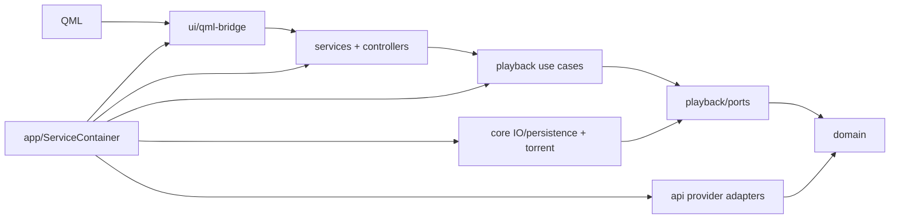

# Kinema architecture

Kinema uses explicit dependency injection and keeps dependencies pointing toward stable domain and playback contracts.

## Source ownership

- `domain/`: provider-independent values and outbound interfaces. It must not depend on application, infrastructure, playback, or UI code.
- `playback/ports/`: contracts consumed by playback orchestration. Ports must not expose API clients, settings, controllers, or UI classes.
- `playback/`: sessions, transfer use cases, policies, and source abstractions. Provider and desktop details enter through ports/adapters.
- `api/<provider>/`: outbound HTTP clients and parsers grouped by provider. Shared request/query helpers live in `api/common/`; indexer adapters live in `api/indexers/`.
- `core/io`, `core/persistence`, `core/mpv`, `core/util`: technical capabilities that are not feature orchestration. Provider-specific helpers do not belong in `core/util`.
- `services/`: application capabilities shared by presentation features, such as `StreamActions`.
- `controllers/`: stateful application orchestration, including credentials, library, downloads, watched state, and subtitles.
- `ui/qml-bridge/<feature>/`: QML-facing state grouped by the page or cross-page feature it supports. Keep QML-visible names stable when moving implementation files.
- `ui/player/`: embedded-player presentation and its adapter to playback ports.
- `app/ServiceContainer`: the sole composition root and owner of long-lived services and view-models.

## Lifetime and asynchronous rules

`ServiceContainer` parents raw QObject-owned services to one anchor. The anchor and unique pointers remain in dependency-safe declaration order, and the QML engine is destroyed before the container. Extracted composition helpers must not introduce another service locator or QObject ownership root.

Every asynchronous UI/controller request uses an epoch guard. Catch failures once with `catch (const std::exception&)` and translate them with `core::describeError`.

## Naming

- `*Client`: outbound provider/HTTP adapter.
- `*Repository`: adapter implementing a persistence port.
- `*Service`: cohesive application capability.
- `*Controller`: stateful application orchestration.
- `*ViewModel` / `*ListModel`: QML-facing presentation state.
- `*Port`: inward-facing abstraction owned by its consumer layer.

Prefer constructor injection of the narrowest settings object or port. Only composition code may know the complete service graph.
